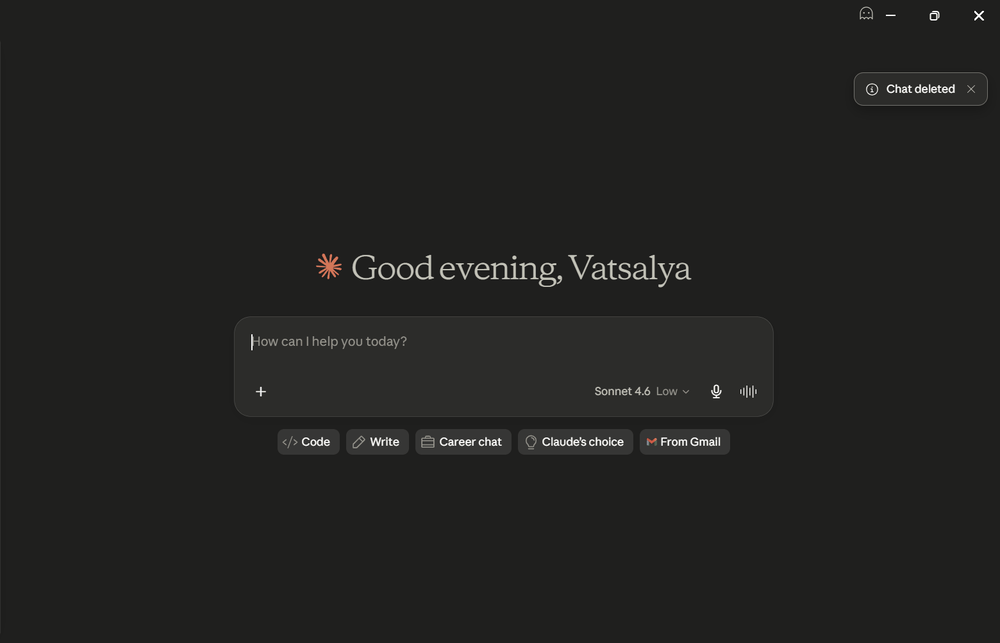

# Trello MCP — n8n

A Model Context Protocol (MCP) server for Trello, built on n8n. Gives Claude (or any MCP client) full read/write access to your Trello boards, lists, cards, and comments.

**18 tools across 4 domains:** Boards · Lists · Cards · Comments

---

## What you can do

Once connected, you can talk to Claude naturally:

- _"What boards do I have?"_
- _"Show me all cards in the Backlog list"_
- _"Create a card called 'Fix login bug' in the To Do list, due Friday"_
- _"Move the API integration card to In Progress"_
- _"Who's assigned to the onboarding card?"_
- _"Archive everything in the Done list"_

---

## Prerequisites

- A [Trello](https://trello.com) account with an API key and token
- An [n8n](https://n8n.io) instance (cloud or self-hosted)
- [Claude Desktop](https://claude.ai/download) or any MCP-compatible client

---

## Setup

### 1. Get your Trello credentials

1. Go to [https://trello.com/power-ups/admin](https://trello.com/power-ups/admin)
2. Create a new Power-Up → get your **API Key**
3. Click **Token** next to your API Key → authorize → copy the **Token**

### 2. Import the workflow into n8n

1. Download [`workflow/trello-mcp-v2.json`](workflow/trello-mcp-v2.json)
2. In n8n: **Workflows → Import → Upload file**
3. Open the imported workflow
4. Click any tool node → **Credentials → Create new → Trello API**
5. Enter your API Key and Token
6. Use the **"Apply credential to all nodes"** option — this assigns it to all 18 nodes at once
7. **Activate** the workflow (toggle top-right)

> **n8n Cloud free tier:** Sign up at [n8n.io](https://n8n.io) — the free tier is sufficient for this workflow.

### 3. Get your MCP endpoint URL

After activating, your MCP endpoint is:

```
https://YOUR-N8N-INSTANCE/mcp/trello-v2
```

For n8n cloud it looks like:
```
https://yourname.app.n8n.cloud/mcp/trello-v2
```

### 4. Connect to Claude Desktop

Install `mcp-remote` if you haven't already:

```bash
npm install -g mcp-remote
```

Add this to your `claude_desktop_config.json`:

**macOS:** `~/Library/Application Support/Claude/claude_desktop_config.json`  
**Windows:** `%APPDATA%\Claude\claude_desktop_config.json`

```json
{
  "mcpServers": {
    "trello": {
      "command": "npx",
      "args": [
        "mcp-remote",
        "https://YOUR-N8N-INSTANCE/mcp/trello-v2"
      ]
    }
  }
}
```

Restart Claude Desktop. You should see Trello tools available in the tools panel.

### 5. Verify it's working

Try this prompt in Claude:

> Get all my Trello boards, then show me the lists on the first one, then show me the cards in the first list.

---

## Tools reference

### Boards

| Tool | Description | Required Params |
|---|---|---|
| `trello_get_all_boards` | All boards the authenticated user can access | — |
| `trello_get_board_members` | All members of a board | `Board_ID` |
| `trello_get_board_labels` | All labels defined on a board | `Board_ID` |

### Lists

| Tool | Description | Required Params |
|---|---|---|
| `trello_get_lists_on_board` | All open lists on a board | `Board_ID` |
| `trello_get_list_cards` | All open cards in a list | `List_ID` |
| `trello_create_list` | Create a new list on a board | `Board_ID`, `List_Name` |
| `trello_archive_list` | Archive a list | `List_ID` |

### Cards

| Tool | Description | Required Params |
|---|---|---|
| `trello_get_board_cards` | All open cards on a board | `Board_ID` |
| `trello_get_card_details` | Full card detail (comments, checklists, attachments) | `Card_ID` |
| `trello_search_cards` | Search cards by keyword or Trello search syntax | `Query` |
| `trello_create_card` | Create a card | `List_ID`, `Card_Name` |
| `trello_update_card` | Update name, description, due date, or list | `Card_ID` |
| `trello_archive_card` | Archive a card | `Card_ID` |
| `trello_move_card` | Move card to a different list or board | `Card_ID`, `Target_List_ID` |
| `trello_assign_member` | Assign a member to a card | `Card_ID`, `Member_ID` |
| `trello_assign_label` | Assign a label to a card | `Card_ID`, `Label_ID` |

### Comments

| Tool | Description | Required Params |
|---|---|---|
| `trello_get_comments` | All comments on a card | `Card_ID` |
| `trello_add_comment` | Add a comment to a card | `Card_ID`, `Comment_Text` |

Full parameter docs: [`docs/tools.md`](docs/tools.md)

---

## Recommended Claude Project system prompt

If you use Claude Projects, add the system prompt from [`docs/system-prompt.md`](docs/system-prompt.md) to give Claude better context on how to use these tools.

---

## Troubleshooting

**Tools not showing in Claude Desktop**
- Confirm the workflow is activated in n8n
- Confirm MCP access is enabled on the workflow (workflow settings → enable MCP)
- Restart Claude Desktop after editing `claude_desktop_config.json`

**Authentication errors**
- Regenerate your Trello token at [https://trello.com/power-ups/admin](https://trello.com/power-ups/admin)
- Update the credential in n8n

**Tool returns empty results**
- Run `trello_get_all_boards` first — most tools require IDs discovered from prior calls
- Confirm you have access to the board in Trello

---

## Roadmap

- [ ] Checklists — `create_checklist`, `add_checklist_item`, `complete_checklist_item`
- [ ] Labels — `create_label`, `delete_label`
- [ ] Webhooks — real-time card update notifications
- [ ] Docker-based standalone deployment (no n8n required)

---

## Contributing

Issues and PRs welcome. See [ISSUE_TEMPLATE](.github/ISSUE_TEMPLATE) for bug reports and feature requests.

---

## License

MIT — see [LICENSE](LICENSE)
